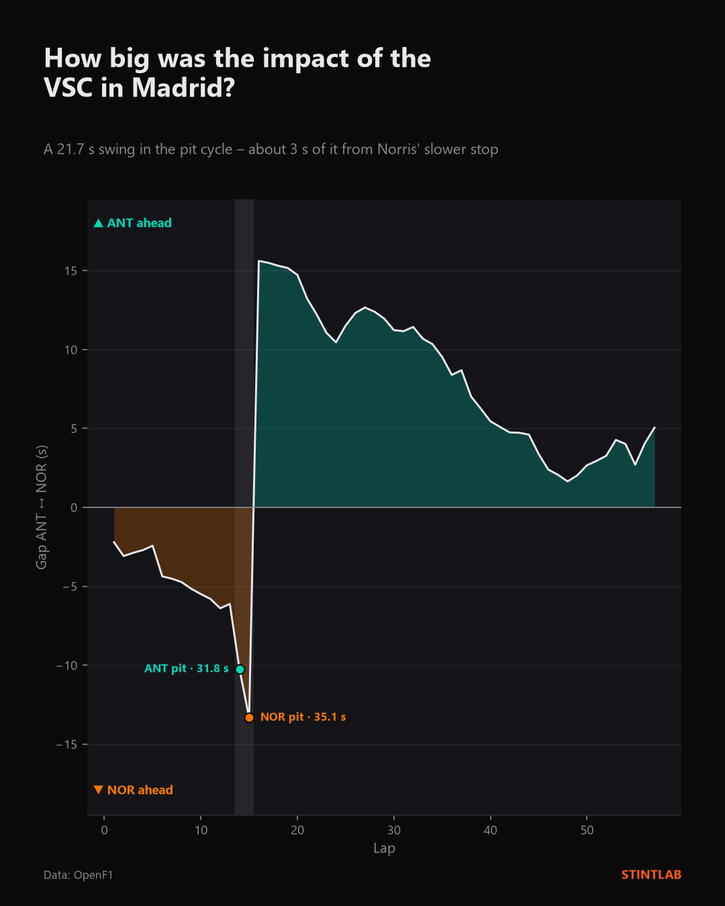
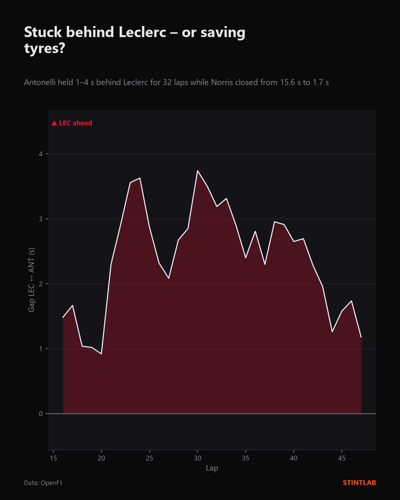
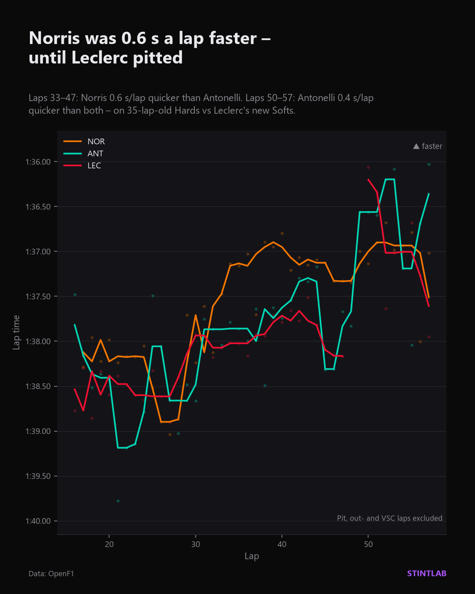

# Madrid 2026 – How big was the impact of the VSC?

Spanish Grand Prix 2026 (Madring), race · 13 September 2026

**Question:** Norris led from pole, Antonelli won. How much of that came from the
Virtual Safety Car on lap 14 – and why did Norris get so close again afterwards?

**Short answer:** The pit cycle swung the gap between Antonelli and Norris by
21.7 s. Only 3.3 s of that came from Norris' longer pit stop; the other 18.4 s
came from *when* they stopped – Antonelli under the VSC, Norris a lap later under
green. Norris then closed in at 0.6 s a lap while Antonelli ran behind Leclerc,
but once Leclerc pitted, Antonelli was the fastest of the three – on 35-lap-old
Hards against Leclerc's new Softs.

## Slides

| | |
|---|---|
|  |  |
|  | |

## Results

**1. The pit cycle (laps 13–16)** – gap Antonelli ↔ Norris, positive = Antonelli ahead

| | Value |
|---|---|
| Gap after lap 13 (before the stops) | −6.12 s |
| Gap after lap 16 (after both stops) | +15.61 s |
| **Total swing** | **21.73 s** |
| Pit lane time Antonelli (lap 14, under VSC) | 31.8 s |
| Pit lane time Norris (lap 15) | 35.1 s |
| Of which: Norris' longer pit lane time | 3.3 s |
| Remainder: timing of the stops, VSC, in-/out-laps | 18.4 s |

**2. Behind Leclerc (laps 16–47)**

Antonelli ran 0.9–3.7 s behind Leclerc for 32 laps. Over the same period Norris
reduced his gap to Antonelli from 15.6 s to 1.7 s (lap 48).

**3. Lap times** – median of cleaned laps

| Driver | Laps 33–47 | Laps 50–57 |
|---|---|---|
| Norris | 1:37.13 | 1:36.96 |
| Antonelli | 1:37.74 | 1:36.58 |
| Leclerc | 1:37.94 | 1:37.01 |

**4. Tyres**

| Driver | Stint 1 | Stint 2 |
|---|---|---|
| Norris | Medium, laps 1–15 | new Hard, laps 16–57 |
| Antonelli | Medium, laps 1–14 | new Hard, laps 15–57 |
| Leclerc | Hard, laps 1–48 | new Soft, laps 49–57 |

Norris and Antonelli ran the same strategy, so Norris' 0.6 s/lap advantage in
laps 33–47 was not a tyre offset.

## Method

- **Data:** [OpenF1](https://openf1.org) – `laps`, `position`, `intervals`,
  `pit`, `race_control`, `stints`, `drivers`.
- **Gap between two drivers:** time difference between the moments both drivers
  cross the line at the end of lap N, from the lap start timestamps
  (end of lap N = start of lap N+1). Deliberately *not* the difference of two
  gap-to-leader values, which breaks whenever the leader changes between the
  two readings (here: Leclerc's pit stop on lap 48).
- **Plausibility check:** for every lap, the driver ahead by line-crossing time
  must also be ahead in the OpenF1 position data. No mismatches for any slide.
- **SC/VSC detection:** replay of race-control messages from `DEPLOYED` to
  `ENDING`; flags that clear a single sector do not end a Safety Car period.
- **Lap-time cleaning:** pit in-laps, out-laps, VSC laps, laps without a time
  and laps slower than 107 % of the fastest shown lap are removed. Lines show a
  centred 3-lap rolling median; single laps are shown as faint dots.

## Limitations

- **The 18.4 s are a remainder, not a measured VSC effect.** They contain
  everything in the pit cycle that is not pit lane time: the reduced loss of
  stopping under the VSC, but also differences in in- and out-laps. Isolating
  the pure VSC effect would need a reference for a green-flag stop at this track.
- **Pit lane time is not stationary time.** `pit_duration` measures the whole
  pit lane transit, not only the time the car was stopped.
- **Traffic is not filtered.** Laps in dirty air stay in the lap-time data.
- **Laps 50–57 are only 8 laps.** The 0.4 s/lap is a tendency, not a precise value.
- **"Saving tyres" is an interpretation.** The data shows that Antonelli had pace
  in hand behind Leclerc; it cannot show *why*. Leclerc may also not have pushed
  on his Softs, or they may have overheated.

## Reproduce

```
python make_post.py posts/2026-madrid/post.toml
```

Requires an OpenF1 account in `.env` (see the main README).
Unofficial analysis – not affiliated with Formula 1, the FIA or any team.